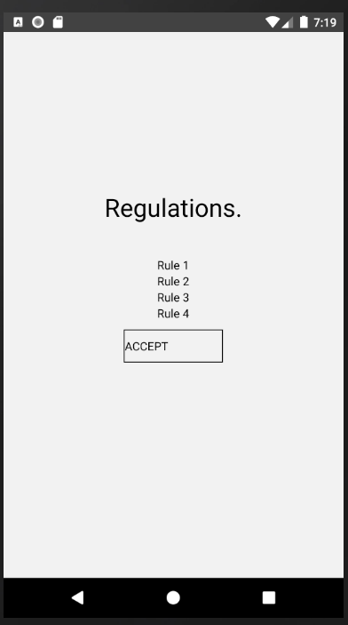
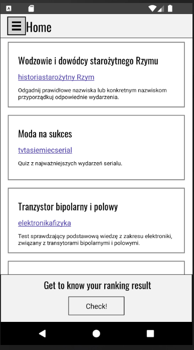
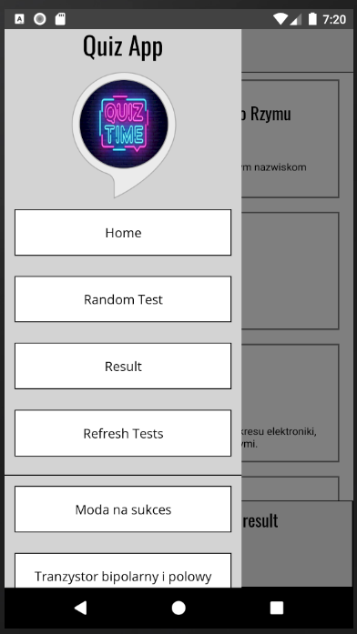
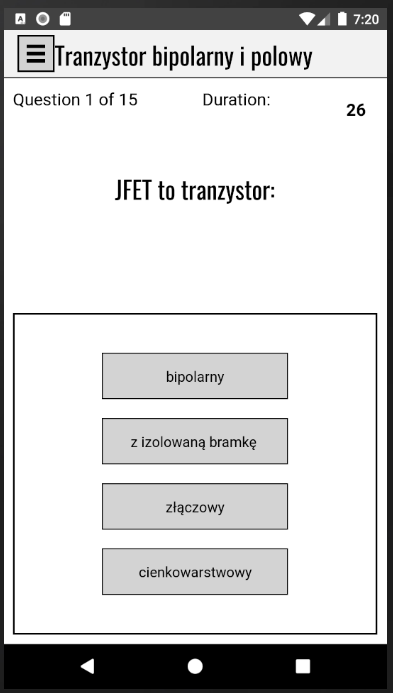
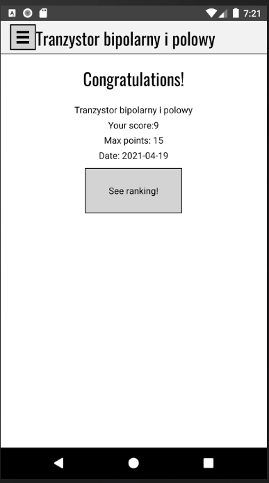
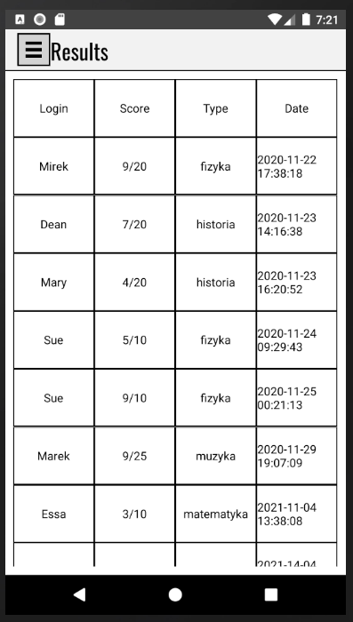

# quiz_react-native

## Technologies

* React Native
* JavaScript
* SQLite

## Features
* Getting quizzes from API
* Saving quizzes once a day in the SQLite database.
* Protection against lack of Internet connection.

## Screenshots

If you open app for the first time you have to accept regulations.

Home page contains list of quizzes downloaded from API. If you want to take a quiz just click on it.

You can open app menu by clicking "hamburger icon" in the upper left corner of the screen. 

Once you enter quiz you have specified time to answer the question. 

When you will end doing quiz your score will be shown.

Results table:

